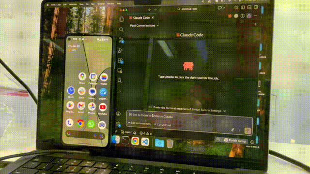

# android-vox

Let Claude Code control your Android phone. 

Say "open the camera and take a photo" and watch it happen.

Uses your claude code subscription to avoid high API fees.



[Watch the demo](https://youtu.be/F1NNxQF9fJY?si=rSocY08Jpoq0-Bfu)

[](https://youtu.be/F1NNxQF9fJY?si=rSocY08Jpoq0-Bfu)

## Examples

Just a few examples of things you can ask Claude to do on your phone:

- "Open the camera and take a photo"
- "Go to Google, search for pictures of dogs, and share one to Slack in the experiments channel"
- "Open Gmail and email `hello@example.com` todays top headlines"
- "Find a funny meme in Chrome and send it to Mom on WhatsApp"
- "Open the claude app on my phone and have a conversation with another claude there"

Try anything really and have fun with it

Claude reads the screen, figures out what to tap, and chains actions together until the task is done.

## Requirements

- [Android Studio](https://developer.android.com/studio) (includes Java, the Android SDK, and `adb`)
- Android phone with USB cable
- Python 3.10+

## Setup

### 1. Enable USB debugging on your phone (one-time)

- **Settings > About phone** > tap "Build number" 7 times
- **Settings > Developer options** > enable **USB debugging**
- Plug phone into your computer via USB
- Accept the debugging authorization prompt on the phone

### 2. Run setup

```bash
git clone https://github.com/shekit/android-vox.git
cd android-vox
./setup.sh
```

This builds and installs the app, sets up port forwarding, installs Python dependencies, and generates the `.mcp.json` config.

If port 8080 is already in use, pick a different one:

```bash
./setup.sh --port 9090
```

### 3. Enable the accessibility service (one-time)

On your phone: **Settings > Accessibility > android-vox > On**

> Without this, the app can't read or control other apps. You only need to do this once.

### 4. Launch app and tap "Enable Remote Control" in the app

Open the android-vox app and tap **Enable Remote Control**.

### 5. Try it

Open Claude Code and say:

```
Open the camera on my phone and take a picture
```

Claude will connect, read the UI tree, launch the camera app, and confirm. See the [examples](#examples) above for more ideas.

> If the MCP tools don't appear, restart Claude Code so it picks up the new `.mcp.json`.

### WiFi setup

The default setup uses USB. To use WiFi instead:

1. Make sure your phone and computer are on the same network
2. Find your phone's IP: **Settings > About phone > IP address**
3. Edit `.mcp.json` and change `VOX_PHONE_HOST` from `localhost` to your phone's IP
4. Set `VOX_PHONE_PORT` to `8080` (the phone always listens on 8080 — the `--port` flag only affects the local USB tunnel)
5. You can skip `adb forward` — WiFi connects directly

## How it works

```
You  →  Claude Code  →  MCP server (Python)  →  WebSocket  →  Phone  →  Accessibility Service  →  App
```

1. Your phone runs a WebSocket server that accepts commands (tap, type, scroll, etc.)
2. A Python MCP server bridges Claude Code to that WebSocket
3. Claude reads the phone's UI tree, decides actions, and executes them autonomously

## Environment variables

| Variable | Default | Description |
|----------|---------|-------------|
| `VOX_PHONE_HOST` | `localhost` | Phone IP (or `localhost` with USB) |
| `VOX_PHONE_PORT` | `8080` | WebSocket port on the phone |
| `VOX_AUTH_TOKEN` | *(none)* | Optional auth token for the WebSocket connection |

## On-device mode (optional) - can get expensive

The app also has a built-in mode that calls an AI model directly from the phone via OpenRouter, without the MCP server:

1. Open the app and tap **Switch to Local Mode**
2. Paste your OpenRouter API key and tap **Save Key**
3. Enter a command and tap **Ask AI**

This makes the phone completely self sufficient (not needing Claude code) but costs more (multiple API calls per task, each with the full UI tree).

## Troubleshooting

| Problem | Fix |
|---------|-----|
| `connection refused` | Make sure you tapped **Enable Remote Control** in the app, and ran `adb forward tcp:8080 tcp:8080` (USB) |
| Actions don't work | Accessibility service not enabled — check **Settings > Accessibility > android-vox** |
| App launch fails | Use exact package names — Claude will call `phone_get_apps()` to look them up |
| MCP tools not showing | Restart Claude Code after adding `.mcp.json`; check that the Python path is correct |
| WiFi connection fails | Phone and computer must be on the same network; check the IP address |

## Security

- The WebSocket connection is **unencrypted**. Use on trusted networks only.
- Anyone who can reach the WebSocket port can control your phone. Use USB mode or a trusted network.
- The accessibility service has full control over the UI — it can tap, type, and read anything on screen.

## License

MIT
